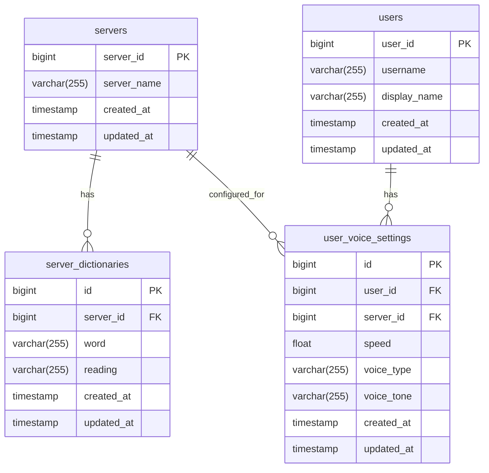

# DB設計

### 概要
読み上げ機能で利用されるデータを永続化するためにDBを利用する

保存する対象
- サーバーごとの設定
    - 読み上げのユーザー辞書辞書

- ユーザーごとの設定
    - 読み上げ速度
    - ボイスの種類、声色

## テーブル設計

### テーブルの説明

#### 1. servers テーブル
Discordサーバーの情報を管理するテーブル
- `server_id`: DiscordサーバーID（主キー）
- `server_name`: サーバー名
- `created_at`, `updated_at`: 作成・更新日時

#### 2. users テーブル
Discordユーザーの情報を管理するテーブル
- `user_id`: DiscordユーザーID（主キー）
- `username`: ユーザー名
- `display_name`: 表示名
- `created_at`, `updated_at`: 作成・更新日時

#### 3. server_dictionaries テーブル
サーバーごとの読み上げ辞書を管理するテーブル
- `id`: 内部ID（主キー）
- `server_id`: 対象サーバーID（外部キー）
- `word`: 辞書登録する単語
- `reading`: 読み上げ方法（ひらがな・カタカナ）
- `created_at`, `updated_at`: 作成・更新日時

#### 4. user_voice_settings テーブル
ユーザーごと・サーバーごとの音声設定を管理するテーブル
- `id`: 内部ID（主キー）
- `user_id`: 対象ユーザーID（外部キー）
- `server_id`: 対象サーバーID（外部キー）
- `speed`: 読み上げ速度（0.1～3.0の範囲）
- `voice_type`: ボイスの種類
- `voice_tone`: 声色
- `created_at`, `updated_at`: 作成・更新日時

### リレーション
- `servers` と `server_dictionaries` は 1:N の関係
- `users` と `user_voice_settings` は 1:N の関係  
- `servers` と `user_voice_settings` は 1:N の関係（ユーザーはサーバーごとに異なる設定を持てる）

### インデックス設計
- `server_dictionaries.server_id` にインデックス
- `server_dictionaries.word` にインデックス
- `user_voice_settings.user_id` にインデックス
- `user_voice_settings.server_id` にインデックス
- `user_voice_settings(user_id, server_id)` に複合ユニークインデックス
